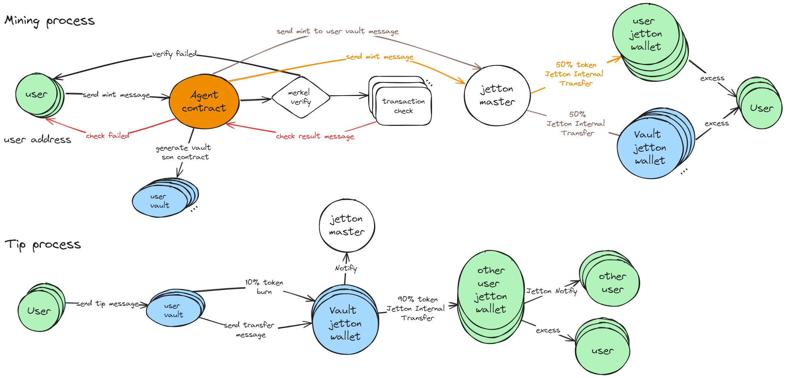

# xfi
XFI is an innovative social media mining platform that aims to provide social media users with a share to earn channel by combining AI technology and blockchain token economics.

## Mint and Tip Complete Process 



## Agent Contract
- TestNet Address: [EQCbW4LsshEROfk_ip3e-ROTV-8A677Vc1IaiDx701kR8G89](https://testnet.tonscan.org/address/EQCbW4LsshEROfk_ip3e-ROTV-8A677Vc1IaiDx701kR8G89)

## Jetton on network metadata
1. Name (usually 1-3 words)：Tweetfi 
2. Symbol (usually 3-5 uppercase characters)：TEF 
3. Amount (for example, 1,000,000)：1,000,000,000
4. Description of the token (optional):TweetFi (TEF) is an innovative social media mining platform that aims to provide social media users with a share to earn channel by combining AI technology and blockchain token economics.
5. Logo (256x256 PNG image)⬇️


### TestNet Address
TEF Master: [0QAUrbgTE2CFri5IsVxZLYrBBLgIqRelMvcWIi-3mekQsQP-](https://testnet.tonviewer.com/kQAUrbgTE2CFri5IsVxZLYrBBLgIqRelMvcWIi-3mekQsV47) 

## How to use
```shell
npm install
```
### Build

```shell
npm run build
```

### Test

```shell
npm run test
```

### Deploy or run another script

```shell
npm run start
```